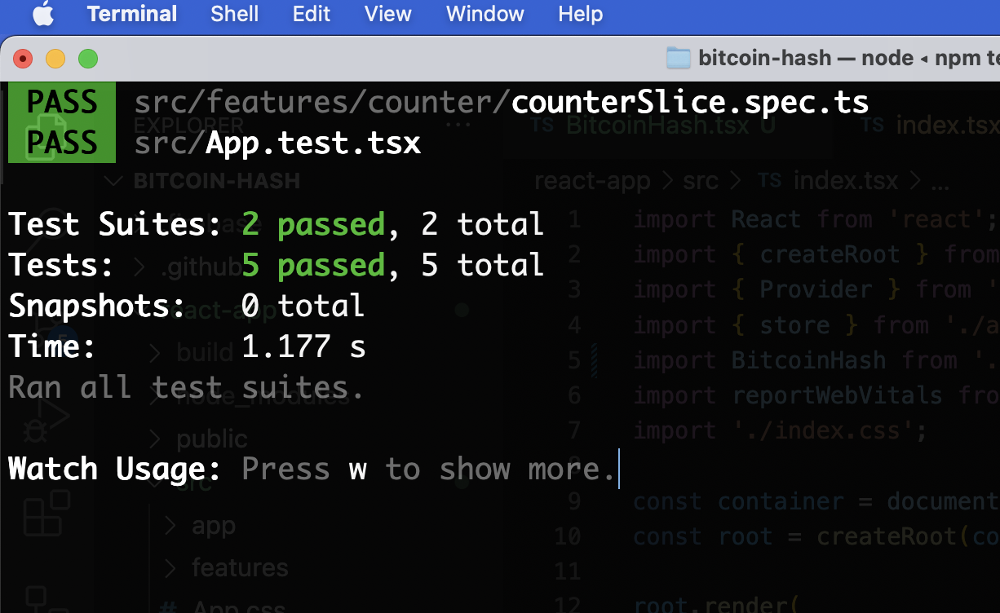

#### Step 2
## React

We use a TDD (Test Driven Development) approach to this project. React has Jest built in, so we'll use that. What we’ll do is start the test suite and keep it running during development time. 


Install dependencies and start the React test suite

```javascript
cd <working-dir>
git clone https://github.com/listingslab/bitcoin-hash
cd bitcoin-hash
npm install
npm test
```



Any time any test breaks, we investigate and thus build better software. The same tests are used in the Continuous Integration [ci.yaml](https://github.com/listingslab/bitcoin-hash/blob/master/.github/workflows/ci.yml) so team members can’t merge broken code into important branches

> Fun Fact. Know what yaml stands for? Yet Another Markup Language