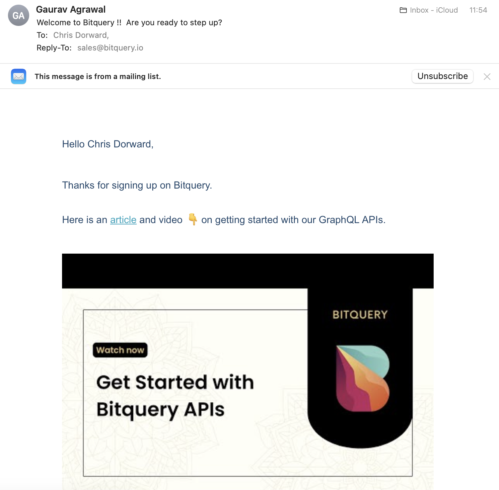

##  Bitquery GraphQL & Apollo

> As a developer I need to easily integrate a React app with a free API service to develop a prototype which retrieves and renders address and transaction data from the BTC blockchain

- [Why GraphQL is better for blockchain data APIs](https://bitquery.io/blog/blockchain-graphql)

#### Apollo GraphQL 

We need a front end library to deal with GraphQL in React. That library is @apollo

- https://www.npmjs.com/package/@apollo/client
- https://www.apollographql.com/docs/react/get-started/
- https://www.apollographql.com/docs/react/data/queries/

## GraphQL Bitquery API

- Track funds using the graph-based Coinpath® technology
- Query tokens/coins distributions and statistics
- Analyze and monitor address activities
- Query statistics of smart contract calls, methods and traces of execution

- [bitquery](https://bitquery.io/about)
- [GraphQL Playground](https://ide.bitquery.io)

- [GraphQL on Bitquery](https://bitquery.io/labs/graphql)
- [Create your first Blockchain GraphQL query](https://bitquery.io/blog/blockchain-graphql-query)

Bitquery's GraphQL APIs support allows you to query almost all data types such as smart contracts, transactions, addresses, DEX trades, DApps, etc. Besides, GraphQL APIs are better than REST APIs because they give the flexibility to express your data needs in the API query. Using our GraphQL Playground, you can create, test, and share Blockchain GraphQL APIs

- Create, test and share query using our GraphQL playgound
- Use simple GraphQL schema as API documentation
- Subscription capability for application monitoring
- Powered by our big data warehouse technology and robust ETL pipeline

Our GraphQL APIs provide a unified interface to query more than 30 blockchains, makes it easier to aggregate data from multiple blockchains. In other words, we use a unified schema, which makes it easier to build solutions that need to support multiple blockchains

GraphQL is an open-source data query and manipulation language for APIs, and a runtime for fulfilling queries with existing data. GraphQL was developed internally by Facebook in 2012 before being publicly open sourced in 2015

- Single endpoint for 30+ blockchain datasets
- Unified schema help scale to multiple blockchains
- Support for smart contracts and token, DApps, DEX and DeFi applications data
- Supports smart contracts and token implementations, including NFTs on Ethereum, Tron, EOS etc

